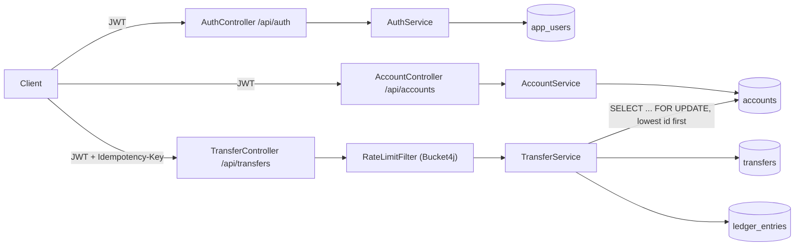
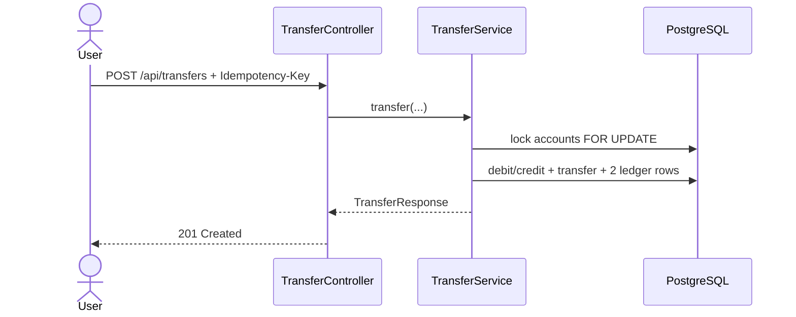

# Retail Banking Core

[](https://github.com/Dedmoo/RetailBankingCore/actions/workflows/ci.yml)

Retail banking monolith: JWT register/login, accounts with freeze/close, money movement as
double-entry ledger posts (opening CREDIT + transfer DEBIT/CREDIT), Postgres + Flyway.

Java 17 / Spring Boot 3.3. Portfolio service, not a bank core.

## Documentation

| Doc | Content |
|-----|---------|
| [docs/architecture.md](docs/architecture.md) | C4 context/container, component view, packaging |
| [docs/uml.md](docs/uml.md) | Transfer sequences, class diagram, ER (Flyway V1–V2) |

## Scope (honest)

| Capability | Status |
|------------|--------|
| Register / login with JWT (Spring Security, stateless) | Implemented |
| Account creation; positive opening balance posts an `OPENING` ledger CREDIT | Implemented |
| Freeze / unfreeze / close (close only when balance is zero) | Implemented |
| Double-entry transfer (`TRANSFER` DEBIT + CREDIT lines, `transfer_id` set) | Implemented |
| Ledger append-only in Postgres (UPDATE/DELETE blocked by trigger) | Implemented |
| Reconciliation: account.balance = Σ CREDIT − Σ DEBIT | Implemented (service + IT) |
| Idempotency key on transfers (`Idempotency-Key` header, required) | Implemented |
| Debit authorization: source account must belong to the caller | Implemented |
| Pessimistic row locking (`SELECT ... FOR UPDATE`), lock order by account id | Implemented |
| Per-user rate limiting on transfers (Bucket4j, in-memory) | Implemented |
| Response security headers (`no-store`, `nosniff`, `DENY` frame) | Implemented |
| Flyway schema (no Hibernate `ddl-auto` mutate) | Implemented |
| Actuator health | Implemented |
| Testcontainers ITs: transfer, concurrency, lifecycle, ledger recon | Implemented |
| Multi-currency / FX | Not included |
| Multi-tenant orgs, roles beyond single user | Not included |
| Cards, loans, statements, interest | Not included |
| Refresh tokens, revocation, password reset | Not included |
| Distributed rate limit (Redis) | Not included |
| KYC/AML, fraud, full audit event stream | Not included |

## Architecture

Quick request path (full C4 + UML in [docs/](docs/)):



Transfer happy path:



## Domain rules enforced

- Money movement only while `ACTIVE` and only for a strictly positive amount. `FROZEN` and
  `CLOSED` reject debit/credit.
- Close requires a zero balance; freeze/unfreeze are owner-only HTTP actions.
- Source account must belong to the caller. Credit to another user's account is allowed (P2P).
- Insufficient funds throws `InsufficientFundsException` inside `Account.debit`.
- Transfer accounts must share currency with each other and the request; same-account transfer rejected.
- Positive opening balance → one `OPENING` CREDIT (external funding, no contra account in this MVP).
  Each transfer → one `TRANSFER` DEBIT and one `TRANSFER` CREDIT for the same amount.
- Account balance must equal signed ledger sum; ITs assert this after open and transfer.
- Accounts locked in fixed id order under `FOR UPDATE` to avoid deadlock and overdraw races.
- Same `Idempotency-Key` per user replays the original transfer. Blank / over-long keys rejected.

## API

| Method | Path | Auth | Description |
|--------|------|------|--------------|
| `POST` | `/api/auth/register` | none | Create a user, returns a JWT |
| `POST` | `/api/auth/login` | none | Returns a JWT |
| `POST` | `/api/accounts` | JWT | Open an account (currency + opening balance) |
| `GET` | `/api/accounts` | JWT | List the caller's accounts |
| `GET` | `/api/accounts/{id}` | JWT | Get one owned account |
| `POST` | `/api/accounts/{id}/freeze` | JWT | Freeze (blocks transfers) |
| `POST` | `/api/accounts/{id}/unfreeze` | JWT | Return to ACTIVE |
| `POST` | `/api/accounts/{id}/close` | JWT | Close when balance is zero |
| `POST` | `/api/transfers` | JWT + `Idempotency-Key` | Double-entry transfer |
| `GET` | `/api/transfers/{id}` | JWT | Get a transfer the caller initiated |
| `GET` | `/actuator/health` | none | Liveness/readiness probe |

## Running it

### Everything in Docker (app + Postgres)

```bash
docker compose up --build
```

The API is then at `http://localhost:8080`.

### Local JVM against dockerized Postgres

```bash
docker compose up -d postgres
./mvnw spring-boot:run      # Linux / macOS
mvnw.cmd spring-boot:run    # Windows
```

### Example flow

```bash
TOKEN=$(curl -s -X POST http://localhost:8080/api/auth/register \
  -H "Content-Type: application/json" \
  -d '{"username":"alice","email":"alice@example.com","password":"correct-horse-battery"}' \
  | jq -r .accessToken)

FROM=$(curl -s -X POST http://localhost:8080/api/accounts \
  -H "Content-Type: application/json" -H "Authorization: Bearer $TOKEN" \
  -d '{"currency":"USD","openingBalance":500.00}' | jq -r .id)

TO=$(curl -s -X POST http://localhost:8080/api/accounts \
  -H "Content-Type: application/json" -H "Authorization: Bearer $TOKEN" \
  -d '{"currency":"USD","openingBalance":0}' | jq -r .id)

curl -s -X POST http://localhost:8080/api/transfers \
  -H "Content-Type: application/json" -H "Authorization: Bearer $TOKEN" \
  -H "Idempotency-Key: demo-transfer-1" \
  -d "{\"fromAccountId\":\"$FROM\",\"toAccountId\":\"$TO\",\"amount\":150.00,\"currency\":\"USD\"}"
```

## Tests

Two test suites, run at different Maven phases on purpose:

```bash
./mvnw test      # unit tests only — no Docker needed
./mvnw verify     # unit tests + Testcontainers integration tests — needs a Docker daemon
```

- **Unit tests** (`*Test.java`): `Account` invariants (funds, freeze/close), `TransferService`
  mocks (idempotency, lock order, ownership), `JwtService`.
- **Integration tests** (`*IT.java`, Failsafe + Testcontainers Postgres): happy-path transfer,
  concurrent overdraw safety, account freeze/close lifecycle, ledger reconciliation and
  append-only trigger.

CI (`.github/workflows/ci.yml`) runs `./mvnw -B verify` on `ubuntu-latest`, which has a Docker
daemon available, so both suites run on every push/PR.

## Configuration

| Property | Default | Purpose |
|----------|---------|---------|
| `BANKING_JWT_SECRET` | dev-only fallback in `application.yml` | HMAC signing key for JWTs — set a real 32+ byte secret outside local dev |
| `banking.jwt.expiration-minutes` | `60` | JWT lifetime |
| `banking.ratelimit.transfer.capacity` | `10` | Requests allowed per window on `POST /api/transfers` |
| `banking.ratelimit.transfer.refill-minutes` | `1` | Window length for the above |

## License

MIT — see [LICENSE](LICENSE).
