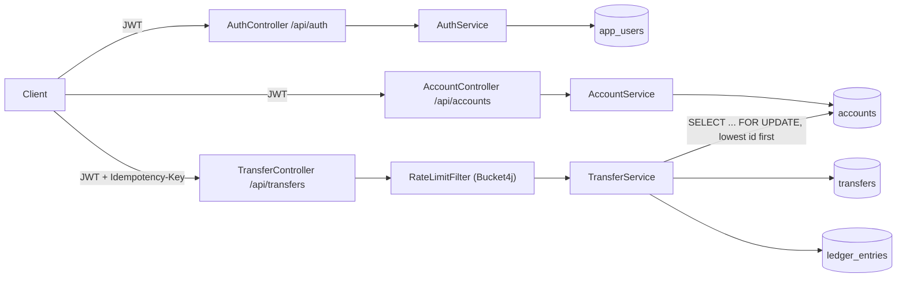

# Retail Banking Core

[](https://github.com/Dedmoo/retail-banking-core/actions/workflows/ci.yml)

A small retail-banking monolith: register/login with JWT, open accounts, and move money between
accounts as a real double-entry transfer, backed by Postgres with Flyway-versioned schema.

Built with **Java 17** and **Spring Boot 3.3**. This is a portfolio MVP, not a bank core system —
see the honest scope table below for exactly what is and is not implemented.

## Scope (honest)

| Capability | Status |
|------------|--------|
| Register / login with JWT (Spring Security, stateless) | Implemented |
| Account creation with an opening balance, single currency per account | Implemented |
| Double-entry transfer between two accounts (one `DEBIT` + one `CREDIT` ledger line per transfer) | Implemented |
| Idempotency key on transfers (`Idempotency-Key` header, required) | Implemented |
| Pessimistic row locking (`SELECT ... FOR UPDATE`) so concurrent transfers can't overdraw an account | Implemented |
| Per-user rate limiting on the transfer endpoint (Bucket4j, in-memory) | Implemented |
| Postgres schema managed by Flyway migrations (no `ddl-auto`/`EnsureCreated`) | Implemented |
| Actuator health endpoint | Implemented |
| Testcontainers integration tests: happy-path transfer, concurrent-transfer safety | Implemented |
| Multi-currency accounts / FX conversion | Not included |
| Multi-tenant SaaS (organizations, branches, roles beyond a single user role) | Not included |
| Card issuance, payments, loans, statements, interest | Not included |
| Refresh tokens, token revocation/blocklist, password reset flow | Not included |
| Distributed rate limiting (Redis) — current limiter is per-instance, in-memory | Not included |
| Audit logging, KYC/AML, fraud detection | Not included |

## Architecture



## Domain rules enforced

- An account can only move money while `ACTIVE`, and only for a strictly positive amount.
- A debit that would take the balance below zero throws `InsufficientFundsException` — enforced
  inside the `Account` entity itself (`debit`/`credit`), not just in the service layer.
- A transfer's source and destination accounts must share the same currency as each other and as
  the request; a transfer to the same account is rejected.
- Every transfer produces exactly two ledger lines (one `DEBIT`, one `CREDIT`) for the same amount,
  so the ledger always balances.
- The two accounts involved in a transfer are locked in a fixed order (lower account id first),
  regardless of which one is the source, so two transfers can never deadlock each other.
- A retried request with the same `Idempotency-Key` (scoped per user) returns the original transfer
  instead of moving money again.

## API

| Method | Path | Auth | Description |
|--------|------|------|--------------|
| `POST` | `/api/auth/register` | none | Create a user, returns a JWT |
| `POST` | `/api/auth/login` | none | Returns a JWT |
| `POST` | `/api/accounts` | JWT | Open an account with a currency + opening balance |
| `GET` | `/api/accounts` | JWT | List the caller's accounts |
| `GET` | `/api/accounts/{id}` | JWT | Get one of the caller's accounts |
| `POST` | `/api/transfers` | JWT + `Idempotency-Key` header | Double-entry transfer between two accounts |
| `GET` | `/api/transfers/{id}` | JWT | Get a transfer the caller initiated |
| `GET` | `/actuator/health` | none | Liveness/readiness probe |

## Running it

### Everything in Docker (app + Postgres)

```bash
docker compose up --build
```

The API is then at `http://localhost:8080`.

### Local JVM against dockerized Postgres

```bash
docker compose up -d postgres
./mvnw spring-boot:run      # Linux / macOS
mvnw.cmd spring-boot:run    # Windows
```

### Example flow

```bash
TOKEN=$(curl -s -X POST http://localhost:8080/api/auth/register \
  -H "Content-Type: application/json" \
  -d '{"username":"alice","email":"alice@example.com","password":"correct-horse-battery"}' \
  | jq -r .accessToken)

FROM=$(curl -s -X POST http://localhost:8080/api/accounts \
  -H "Content-Type: application/json" -H "Authorization: Bearer $TOKEN" \
  -d '{"currency":"USD","openingBalance":500.00}' | jq -r .id)

TO=$(curl -s -X POST http://localhost:8080/api/accounts \
  -H "Content-Type: application/json" -H "Authorization: Bearer $TOKEN" \
  -d '{"currency":"USD","openingBalance":0}' | jq -r .id)

curl -s -X POST http://localhost:8080/api/transfers \
  -H "Content-Type: application/json" -H "Authorization: Bearer $TOKEN" \
  -H "Idempotency-Key: demo-transfer-1" \
  -d "{\"fromAccountId\":\"$FROM\",\"toAccountId\":\"$TO\",\"amount\":150.00,\"currency\":\"USD\"}"
```

## Tests

Two test suites, run at different Maven phases on purpose:

```bash
./mvnw test      # unit tests only — no Docker needed
./mvnw verify     # unit tests + Testcontainers integration tests — needs a Docker daemon
```

- **Unit tests** (`*Test.java`, run by Surefire in the `test` phase): domain invariants on
  `Account` (debit/credit, insufficient funds, closed-account rejection), `TransferService`
  orchestration with mocked repositories (idempotency replay, same-account/currency rejection,
  lock ordering), and `JwtService` token generation/validation.
- **Integration tests** (`*IT.java`, run by Failsafe in the `verify` phase, each spinning up a real
  Postgres via Testcontainers): `TransferHappyPathIT` drives the full register → open accounts →
  transfer → idempotent retry flow over HTTP, and `TransferConcurrencyIT` fires two transfers at
  the same source account at once and asserts exactly one succeeds and the account never goes
  negative — the actual proof that the pessimistic locking works, not just a mock-based assertion.

CI (`.github/workflows/ci.yml`) runs `./mvnw -B verify` on `ubuntu-latest`, which has a Docker
daemon available, so both suites run on every push/PR.

## Configuration

| Property | Default | Purpose |
|----------|---------|---------|
| `BANKING_JWT_SECRET` | dev-only fallback in `application.yml` | HMAC signing key for JWTs — set a real 32+ byte secret outside local dev |
| `banking.jwt.expiration-minutes` | `60` | JWT lifetime |
| `banking.ratelimit.transfer.capacity` | `10` | Requests allowed per window on `POST /api/transfers` |
| `banking.ratelimit.transfer.refill-minutes` | `1` | Window length for the above |

## License

MIT — see [LICENSE](LICENSE).
