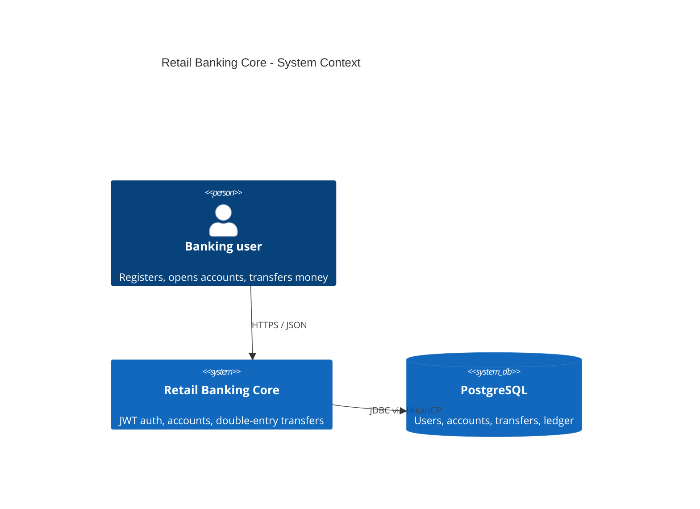
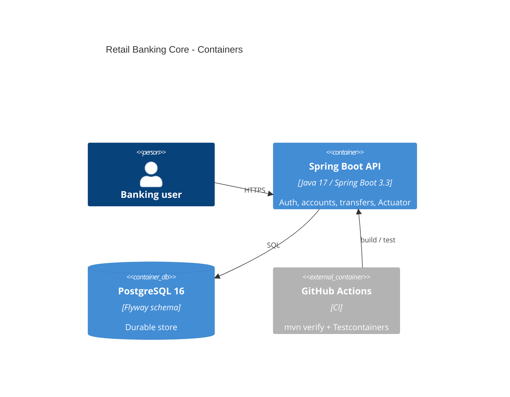

# Architecture

C4 and component views for RetailBankingCore. Portfolio service, not a production bank core.

## C4 Context



## C4 Container



## Component view (inside the API)

```mermaid
flowchart TB
  subgraph http [HTTP]
    AuthC[AuthController]
    AccC[AccountController]
    TrfC[TransferController]
    Health[/actuator/health]
  end

  subgraph security [Security]
    JwtF[JwtAuthenticationFilter]
    RateF[RateLimitFilter Bucket4j]
  end

  subgraph app [Services]
    AuthS[AuthService]
    AccS[AccountService]
    TrfS[TransferService]
    JwtS[JwtService]
  end

  subgraph data [Persistence]
    Users[(app_users)]
    Accounts[(accounts)]
    Transfers[(transfers)]
    Ledger[(ledger_entries)]
  end

  AuthC --> AuthS --> Users
  AuthS --> JwtS
  AccC --> AccS --> Accounts
  AccS --> Ledger
  TrfC --> RateF --> TrfS
  TrfS --> Accounts
  TrfS --> Transfers
  TrfS --> Ledger
  JwtF --> JwtS
```

## Ledger rules

- `OPENING`: one CREDIT, `transfer_id` null (funding into the product; no equity contra account here)
- `TRANSFER`: paired DEBIT + CREDIT with the same `transfer_id`
- Table is append-only (Postgres triggers reject UPDATE/DELETE)
- `accounts.balance` must equal Σ CREDIT − Σ DEBIT (`LedgerReconciliationService`)

## Runtime packaging

- Local / CI: JVM + Postgres (Compose or Testcontainers)
- Schema only via Flyway (`V1`, `V2`), Hibernate `ddl-auto=validate`
